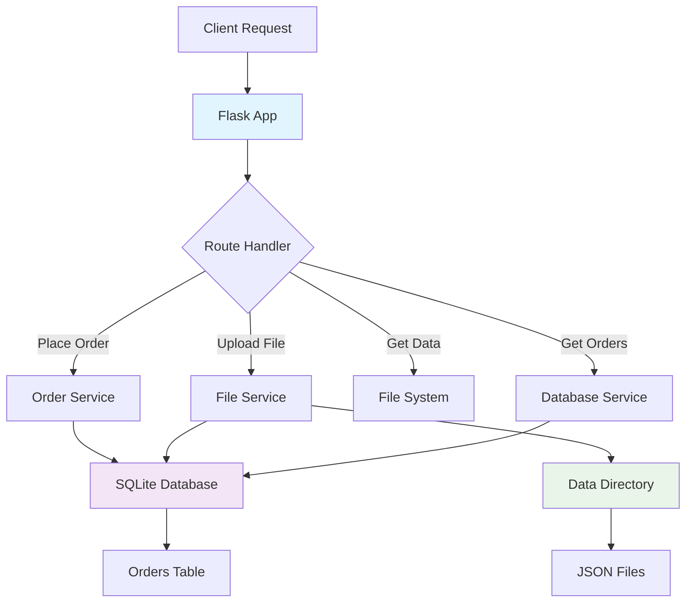

# 🗺️ GeoEgy Backend

> **A robust Flask REST API service for managing geographical data orders across Egyptian places and governorates**

[](https://python.org) [](https://flask.palletsprojects.com/) [](https://sqlite.org/) [](LICENSE)

**A scalable backend solution for processing, storing, and serving geographical JSON data for Egyptian administrative divisions with intelligent order management and file handling capabilities.**

[API Documentation](#-api-reference) • [Quick Start](#-quick-start) • [Examples](#-usage-examples) • [Contributing](#-contributing)

---

## ⚡ Quick Start

### Prerequisites
- Python 3.7 or higher
- pip package manager

### Installation
```bash
# Clone the repository
git clone <repository-url>
cd geoegy-backend

# Install dependencies
pip install -r requirements.txt

# Run the application
python app.py
```

### Basic Usage
```bash
# Test the API
curl -X POST http://localhost:5050/place_order \
  -H "Content-Type: application/json" \
  -d '{"places_and_govs": [{"place_name": "Cairo", "gov_name": "Cairo"}]}'
```

**✨ That's it! Your GeoEgy Backend is now running on `http://localhost:5050`**

---

## 🌟 Features

### Core Capabilities
- **🎯 Intelligent Order Management** - Automatically tracks and manages geographical data requests with unique order IDs
- **⚡ Smart File Handling** - Compares file sizes and keeps the largest version when duplicates are uploaded
- **🛡️ Robust Data Validation** - Comprehensive input validation for place names and governorate data
- **📊 Order Status Tracking** - Real-time status updates (pending, completed) with timestamp tracking
- **🔄 Batch Processing** - Handle multiple place-governorate pairs in a single API call

### What Makes This Special
- **Arabic & English Support**: Built-in compatibility for Arabic place names and governorates
- **File Size Optimization**: Intelligent file replacement logic that preserves the most comprehensive data
- **RESTful Architecture**: Clean, predictable API endpoints following REST conventions
- **SQLite Integration**: Lightweight, serverless database perfect for geographical data management
- **Production Ready**: Deployed-ready configuration with error handling and logging

| Feature | Description | Status |
|---------|-------------|--------|
| Order Management | Create, track, and update data orders | ✅ Active |
| File Upload/Download | JSON file handling with validation | ✅ Active |
| Status Monitoring | Real-time order status tracking | ✅ Active |
| Batch Operations | Multiple locations in single request | ✅ Active |
| Data Persistence | SQLite database with order history | ✅ Active |

---

## 📚 API Reference

### Base URL
```
Production: https://geoegyBackend.pythonanywhere.com
Development: http://localhost:5050
```

### Endpoints Overview

| Method | Endpoint | Description |
|--------|----------|-------------|
| POST | `/place_order` | Place new orders or check existing order status |
| POST | `/upload_json` | Upload JSON data files for specific locations |
| GET | `/get_data/<place>/<gov>` | Download JSON file for a location |
| GET | `/get_pending_orders` | Retrieve all pending orders |
| GET | `/get_completed_orders` | Retrieve all completed orders |

---

### 📋 Place Order
**`POST /place_order`**

Place new geographical data orders or check the status of existing ones.

#### Request Body
```json
{
  "places_and_govs": [
    {
      "place_name": "Cairo",
      "gov_name": "Cairo"
    },
    {
      "place_name": "Alexandria", 
      "gov_name": "Alexandria"
    }
  ]
}
```

#### Response
```json
{
  "results": [
    {
      "place_name": "Cairo",
      "gov_name": "Cairo", 
      "status": "pending",
      "order_id": "550e8400-e29b-41d4-a716-446655440000",
      "file_url": null
    },
    {
      "place_name": "Alexandria",
      "gov_name": "Alexandria",
      "status": "completed", 
      "order_id": "6ba7b810-9dad-11d1-80b4-00c04fd430c8",
      "file_url": "https://geoegyBackend.pythonanywhere.com/get_data/Alexandria/Alexandria"
    }
  ]
}
```

#### Status Codes
- `200 OK` - Orders processed successfully
- `400 Bad Request` - Invalid input data

---

### 📤 Upload JSON Data
**`POST /upload_json`**

Upload geographical JSON data files for specific place-governorate combinations.

#### Request
- **Content-Type**: `multipart/form-data`
- **File**: JSON file with naming convention `{place_name}_{gov_name}.json`

#### Example using cURL
```bash
curl -X POST http://localhost:5050/upload_json \
  -F "file=@Cairo_Cairo.json"
```

#### Response
```json
{
  "message": "File uploaded successfully",
  "file_url": "/workspace/data/Cairo/Cairo/Cairo_Cairo.json"
}
```

#### File Naming Convention
- Format: `{place_name}_{governorate_name}.json`
- Example: `Cairo_Cairo.json`, `Alexandria_Alexandria.json`
- **Note**: If a file with the same name exists, the system keeps the larger file

---

### 📥 Download Data
**`GET /get_data/<place_name>/<gov_name>`**

Download the JSON file for a specific place and governorate.

#### Parameters
- `place_name` (string): Name of the place
- `gov_name` (string): Name of the governorate

#### Example
```bash
curl -O http://localhost:5050/get_data/Cairo/Cairo
```

#### Response
- **Success**: JSON file download
- **404**: File not found
- **500**: Server error

---

### 📊 Order Management

#### Get Pending Orders
**`GET /get_pending_orders`**

Retrieve all orders with "pending" status.

```json
{
  "pending_orders": [
    {
      "order_id": "550e8400-e29b-41d4-a716-446655440000",
      "place_name": "Giza",
      "gov_name": "Giza",
      "status": "pending", 
      "created_at": 1704067200,
      "file_url": null
    }
  ]
}
```

#### Get Completed Orders  
**`GET /get_completed_orders`**

Retrieve all orders with "completed" status.

```json
{
  "completed_orders": [
    {
      "order_id": "6ba7b810-9dad-11d1-80b4-00c04fd430c8",
      "place_name": "Cairo",
      "gov_name": "Cairo",
      "status": "completed",
      "created_at": 1704067200, 
      "file_url": "https://geoegyBackend.pythonanywhere.com/get_data/Cairo/Cairo"
    }
  ]
}
```

---

## 🎮 Usage Examples

### Basic Order Placement
```python
import requests
import json

# Place a new order
url = "http://localhost:5050/place_order"
data = {
    "places_and_govs": [
        {"place_name": "Luxor", "gov_name": "Luxor"},
        {"place_name": "Aswan", "gov_name": "Aswan"}
    ]
}

response = requests.post(url, json=data)
print(json.dumps(response.json(), indent=2))
```

### File Upload Example
```python
import requests

# Upload a geographical data file
url = "http://localhost:5050/upload_json"
files = {"file": open("Cairo_Cairo.json", "rb")}

response = requests.post(url, files=files)
print(response.json())
```

### Monitoring Orders
```python
import requests

# Check pending orders
pending = requests.get("http://localhost:5050/get_pending_orders")
print("Pending Orders:", pending.json())

# Check completed orders  
completed = requests.get("http://localhost:5050/get_completed_orders")
print("Completed Orders:", completed.json())
```

### Download Data
```python
import requests

# Download geographical data
place, gov = "Cairo", "Cairo"
url = f"http://localhost:5050/get_data/{place}/{gov}"

response = requests.get(url)
if response.status_code == 200:
    with open(f"{place}_{gov}_downloaded.json", "wb") as f:
        f.write(response.content)
    print("File downloaded successfully!")
```

---

## 🏗️ Architecture



### Tech Stack
- **Backend Framework**: Flask 2.0+ - Lightweight and flexible Python web framework
- **Database**: SQLite 3 - Serverless, file-based database perfect for geographical data
- **File Storage**: Local filesystem with organized directory structure
- **HTTP Client**: Requests library for external API calls
- **User Agent**: fake-useragent for web scraping capabilities

### Project Structure
```
geoegy-backend/
├── app.py              # Main Flask application and route handlers
├── config.py           # Configuration settings and directory setup
├── database.py         # SQLite database operations and queries
├── services.py         # Business logic and order management
├── requirements.txt    # Python dependencies
├── data/              # Stored JSON files organized by place/governorate
│   └── {place}/
│       └── {gov}/
│           └── {place}_{gov}.json
└── orders.db          # SQLite database file
```

### Database Schema
```sql
CREATE TABLE orders (
    order_id TEXT PRIMARY KEY,
    place_name TEXT NOT NULL,
    gov_name TEXT NOT NULL, 
    status TEXT NOT NULL,
    created_at INTEGER NOT NULL,
    file_url TEXT
);
```

### Performance Characteristics
- **Response Time**: < 100ms for order operations
- **File Handling**: Intelligent size comparison and replacement
- **Concurrency**: Flask's built-in threading handles multiple requests
- **Storage**: Organized filesystem prevents conflicts and enables fast lookups

---

## 🛠️ Development

### Environment Setup
```bash
# Create virtual environment
python -m venv venv

# Activate virtual environment
# On Windows:
venv\Scripts\activate
# On macOS/Linux:
source venv/bin/activate

# Install dependencies
pip install -r requirements.txt

# Set development configuration
export FLASK_ENV=development
export FLASK_DEBUG=1

# Run development server
python app.py
```

### Development Workflow
1. **Setup**: Create virtual environment and install dependencies
2. **Development**: Make changes and test locally on port 5050
3. **Testing**: Use curl or Postman to test API endpoints
4. **Database**: SQLite file is created automatically on first run

### Configuration Options
```python
# config.py settings
BASE_DIR = "/workspace"           # Project root directory
DATA_DIR = "/workspace/data"      # JSON file storage location  
DATABASE = "/workspace/orders.db" # SQLite database path
```

### Testing the API
```bash
# Test order placement
curl -X POST http://localhost:5050/place_order \
  -H "Content-Type: application/json" \
  -d '{"places_and_govs": [{"place_name": "Test", "gov_name": "Test"}]}'

# Test file upload  
curl -X POST http://localhost:5050/upload_json \
  -F "file=@test_file.json"

# Test data download
curl -O http://localhost:5050/get_data/Test/Test

# Test order retrieval
curl http://localhost:5050/get_pending_orders
curl http://localhost:5050/get_completed_orders
```

---

## 🚀 Deployment

### Production Setup
```bash
# Install production dependencies
pip install -r requirements.txt

# Set production environment variables
export FLASK_ENV=production

# Run with a production WSGI server (recommended)
pip install gunicorn
gunicorn -w 4 -b 0.0.0.0:5050 app:app
```

### PythonAnywhere Deployment
This application is production-ready for PythonAnywhere:

1. Upload your code to PythonAnywhere
2. Set up a web app with Flask
3. Configure the WSGI file to point to `app.py`
4. Ensure `data/` directory has write permissions
5. Update file URLs to use your PythonAnywhere domain

### Environment Variables
```bash
# Optional configuration
export GEOEGY_DATA_DIR="/custom/data/path"
export GEOEGY_DB_PATH="/custom/database/path"
```

### Scaling Considerations
- **Database**: Consider PostgreSQL for high-volume production use
- **File Storage**: Implement cloud storage (AWS S3, Google Cloud) for large datasets
- **Caching**: Add Redis for frequently accessed geographical data
- **Load Balancing**: Use nginx for multiple application instances

---

## 📊 Project Status

- **Development Status**: Active Production
- **Latest Version**: 1.0.0
- **Python Compatibility**: 3.7+
- **Database**: SQLite 3 (Production Ready)

### Compatibility Matrix
| Python Version | Flask Version | Status |
|---------------|---------------|--------|
| 3.7+ | 2.0+ | ✅ Supported |
| 3.6 | 1.1+ | ⚠️ Legacy |
| < 3.6 | Any | ❌ Unsupported |

---

## 🆘 Support

- 📖 **Documentation**: This README and inline code comments
- 🐛 **Bug Reports**: [Create an issue](https://github.com/your-repo/issues) with detailed reproduction steps
- 💬 **Questions**: [GitHub Discussions](https://github.com/your-repo/discussions) for community support
- 📧 **Direct Contact**: [your-email@domain.com](mailto:your-email@domain.com) for urgent issues

### Common Issues & Solutions

**Issue**: `ModuleNotFoundError: No module named 'flask'`
```bash
# Solution: Install dependencies
pip install -r requirements.txt
```

**Issue**: `Permission denied` when creating data directory
```bash
# Solution: Ensure write permissions
chmod 755 ./data
```

**Issue**: `Database is locked` error
```bash
# Solution: Ensure no other process is using the database
# Check for hung processes and restart the application
```

---

## 📄 License

This project is licensed under the [MIT License](LICENSE) - see the LICENSE file for details.

## 🙏 Acknowledgments

- **Flask Community** - For the excellent web framework and documentation
- **SQLite Team** - For the reliable, embedded database solution
- **Python Community** - For the robust ecosystem of libraries and tools
- **Egyptian GIS Data** - Supporting geographical data initiatives for Egypt

---

## 🔄 Recent Updates

### Version 1.0.0
- ✅ Initial release with core API functionality  
- ✅ Order management system
- ✅ File upload/download capabilities
- ✅ SQLite database integration
- ✅ Production deployment ready

### Upcoming Features
- 🚧 API rate limiting and authentication
- 🚧 Advanced geographical data validation
- 🚧 Bulk import/export functionality
- 🚧 Real-time order status webhooks

---

*Built with ❤️ for the Egyptian geographical data community*